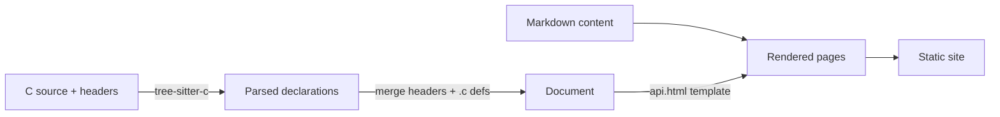

# Getting Started

```c
#include "mathutil.h"

int main(void) {
    int sum = mu_add(2, 3);
    double clamped = mu_clamp(4.2, 0.0, 1.0);
    return 0;
}
```

See the [API reference](api.html) for full details on every function.

## How mkcdoc builds this site


